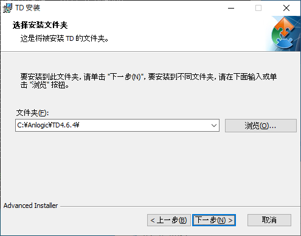
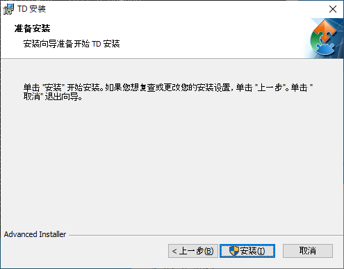
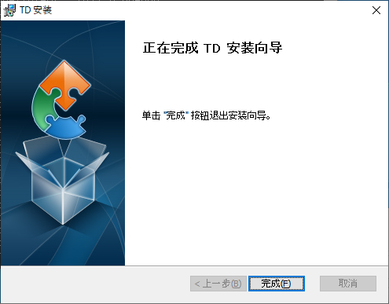
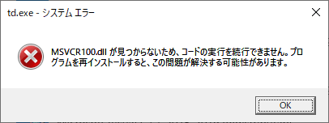
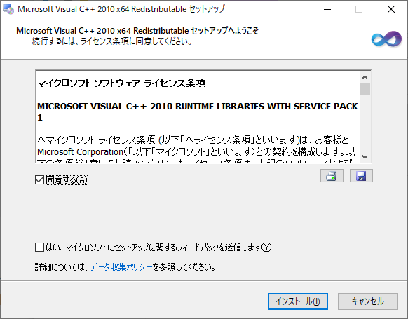
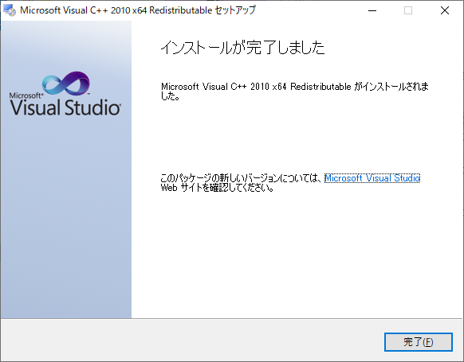

# Tang Dynasty入門

## Tang Dynastyのインストール

下記のURLの場所からインストーラーをダウンロードして下さい。

https://dl.sipeed.com/TANG/Primer/IDE

本入門の執筆時の最新版は、

- Linux : TD_RELEASE_March2020_r4.6.4_RHEL.zip
- Windows : TD_RELEASE_March2020_r4.6.4_64bit.msi

です。

### Linux

### Windows

#### Tang Dynasty本体のインストール

インストーラー(本入門の執筆時の最新版は TD_RELEASE_March2020_r4.6.4_64bit.msi)を実行してください。

青枠で囲まれたボタンを押してください

必要であればインストールパスを選択して、青枠で囲まれたボタンを押してください

青枠で囲まれたボタンを押してインストールを開始してください

青枠で囲まれたボタンを押してインストールを終了してください

#### Microsoft Visual C++ 2010のインストール

Tang Dynastyを実行して下記の画面が出た場合は、「Microsoft Visual C++ 2010 Service Pack 1 再頒布可能パッケージ 」をインストールしてください

https://www.microsoft.com/ja-jp/download/details.aspx?id=26999

#### ライセンスファイルのインストール

#### ドライバのイストール
